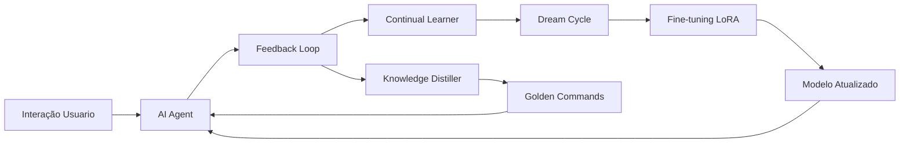

# 🧠 Sistema de Aprendizado Contínuo - JARVIS 5.0

**Versão:** 5.0 Singularity  
**Última Atualização:** Fevereiro 2026  
**Status:** ✅ Produção

---

## 📑 Índice

1. [Visão Geral](#-visão-geral)
2. [Arquitetura do Sistema](#-arquitetura-do-sistema)
3. [Componentes](#-componentes)
4. [Guia de Uso](#-guia-de-uso)
5. [Configuração](#-configuração)
6. [Monitoramento](#-monitoramento)
7. [Troubleshooting](#-troubleshooting)
8. [FAQ](#-faq)

---

## 📋 Visão Geral

### Objetivo

O Sistema de Aprendizado Contínuo permite que o JARVIS evolua autonomamente através de cada interação, transformando-se gradualmente de uma IA dependente de modelos externos em um assistente personalizado e independente.

### Filosofia: Da Dependência à Singularidade

```
┌─────────────────────────────────────────────────────────┐
│          JORNADA EVOLUTIVA DO JARVIS                    │
└─────────────────────────────────────────────────────────┘

FASE 1: APRENDIZ                    FASE 2: AUTONOMIA                FASE 3: SINGULARIDADE
┌─────────────┐                     ┌─────────────┐                 ┌─────────────┐
│ Depende de  │ ──Learning──>       │ Usa tutores │ ──Fine-tune──> │ Modelo      │
│ DeepSeek/   │   Feedback           │ como ref.   │   Contínuo     │ Único &     │
│ Llama       │   Daily              │ Local Brain │   Nightly      │ Customizado │
│ (Externos)  │                      │ evolui      │                │ (Seu JARVIS)│
└─────────────┘                     └─────────────┘                 └─────────────┘
     100% Cloud                         50/50 Mix                      100% Local
```

---

## 🏗️ Arquitetura do Sistema

### Fluxo de Evolução



### Stack Tecnológico

| Componente | Tecnologia | Função |
|------------|-----------|--------|
| **Base Model** | Qwen 2.5-1.5B | Modelo local principal |
| **Fine-tuning** | LoRA/QLoRA | Adaptação eficiente |
| **Training** | Transformers + PEFT | Pipeline de treinamento |
| **Database** | SQLite | Armazenamento de feedback |
| **Scheduling** | Python threading | Automação de ciclos |

---

## 🧩 Componentes

### 1. Feedback Loop
**Arquivo:** `src/learning/feedback_loop.py`  
**Status:** ✅ Ativo  

#### Função
Coleta e armazena feedback de todas as interações

#### Tipos de Feedback

**a) Feedback Implícito (Automático)**
| Métrica | Indicador | Peso |
|---------|-----------|------|
| Tempo de resposta | < 1s = positivo | 0.3 |
| Repetição de comando | Sim = negativo | -0.5 |
| Ações bem-sucedidas | 100% = positivo | 0.7 |
| Interrupção | Sim = negativo | -0.8 |

**b) Feedback Explícito (Manual)**
- 👍 Good Response: +1.0
- 👎 Bad Response: -1.0
- Correção textual: Cria par de preferência DPO

#### Armazenamento
```
data/
└── learning/
    └── feedback.db  (SQLite)
        ├── feedback_entries
```
┌─────────────────────────────────────────┐
│ 1. Monitor Loop (a cada 1h)            │
│    └─> Conta feedbacks pendentes       │
│                                         │
│ 2. Threshold Check (≥100 feedbacks)    │
│    └─> Gera pares de preferência DPO   │
│                                         │
│ 3. Dataset Generation                  │
│    └─> Salva JSON em training_dataset/ │
│                                         │
│ 4. Fine-tuning (LoRA)                  │
│    └─> 1 época, batch size 2           │
│                                         │
│ 5. Checkpoint Save                     │
│    └─> models/continual/checkpoint-N   │
│                                         │
│ 6. Flush Database                      │
│    └─> Marca feedbacks como processados│
└─────────────────────────────────────────┘
```

#### Configuração
Arquivo:/learning/continual_learner.py`  
**Status:** ✅ Ativo  
    # Feedbacks para disparar treino
  check_interval: 3600         # Verificar a cada 1 hora (segundos)
  training_batch_size: 2       # Batch size do treino
  gradient_accumulation_steps: 2
  num_epochs: 1                # Épocas por ciclo
  save_steps: 100              # Salvar checkpoint a cada N steps
```

#### Output
```
data/models/continual/
├── checkpoint-100/
├── checkpoint-200/
└── final/
    ├── adapter_config.json
    ├── adapter_model.bin
    └── training_args.bin
```

---

### 3. Knowledge Distiller
**Arquivo:** `src/learning/knowledge_distiller.py`  
**Status:** ✅ Ativo  

#### Função
Identifica e armazena padrões de comandos bem-sucedidos (Golden Commands)

#### Critérios de Seleção
continual_learner:
| Critério | Valor | Descrição |
|----------|-------|-----------|
| **Success Rate** | > 70% | Feedback positivo consistente |
| **Usage Count** | ≥ 2 | Usado múltiplas vezes |
| **Action Success** | 100% | Todas ações executadas sem erro |

#### Armazenamento
Arquivo: `data/memories/gold_commands.json`

Cada ciclo melhora a precisão do modelo

---

### 3. **Knowledge Distiller** ✨
**Função:** Extrai "Golden Commands" - padrões de sucesso comprovados

**Como Funciona:**
1. Analisa interações bem-sucedidas
2. Identifica comandos repetidos com alta taxa de aprovação
3. Armazena como exemplos de ouro
4. Injeta esses exemplos no contexto de comandos similares (Few-Shot Learning)

**Golden Commands:**
- Armazenados em: `data/memories/gold_commands.json`
- Formato:
```json
{
  "abrir navegador": {
    "command": "abrir navegador",
    "thought": "Usuário quer iniciar Chrome",
    "actions": ["open_program10:30:00"
  }
}
```

#### Injeção no Contexto (Few-Shot Learning)
Quando usuário faz comando similar, golden commands são injetados no prompt:
```
### EXEMPLOS DE SUCESSO ANTERIORES (GOLDEN COMMANDS):
Comando: abrir navegador
Raciocínio: Usuário quer iniciar Chrome
Ações: ["open_program('chrome')"]

Comando atual: abrir chrome
```

---

| Condição | Valor Padrão | Obrigatório |
|----------|--------------|-------------|
| **CPU Usage** | < 20% | ✅ Sim |
| **Memory Usage** | < 80% | ✅ Sim |
| **Horário** | 22h - 6h | ✅ Sim |
| **Idle Time** | ≥ 5 min | ✅ Sim |

#### Workflow
```
┌──────────────────────────────────────────┐
│ 1. Monitor Thread (1 min interval)      │
│    └─> Verifica CPU, RAM, Hora, Idle    │
│                                          │
│ 2. Todas condições OK?                  │
│    └─> Sim: Inicia training task        │
│    └─> Não: Aguarda próximo check       │
│                                          │
│ 3. Training Task (Background Thread)    │
│    └─> Consolida feedbacks              │
│    └─> Fine-tuning LoRA                 │
│    └─> Salva checkpoint                 │
│                                          │
│ 4. Activity Detected?                   │
│    └─> Sim: Pausa training gracefully   │
│    └─> Não: Continua até completar      │
└──────────────────────────────────────────┘
```

#### Configuração
Arquivo: `config/ai_config.yaml`
**Como Funciona:**
1. Monitora sistema continuamente
2. Detecta ociosidade:
   - CPU < 20%
   - Horário noturno (22h - 6h)
   - 5 minutos sem atividade
3. Inicia treinamento em background
4. Pausa se usuário voltar a usar o sistema

**Configuração:**
```yaml
dream_cycle:
  enabled: true
  night_start_hour: 22         # 22h (10 PM)
  night_end_hour: 6            # 6h (6 AM)
  min_idle_duration: 300       # 5 minutos (segundos)
  max_cpu_percent: 20.0        # CPU abaixo de 20%
  max_memory_percent: 80.0     # RAM abaixo de 80%
  check_interval: 60           # Verificar a cada 1 min
```

---

### 5. Local Brain Evolution
**Arquivo:** `src/core/intelligence/local_brain.py`  
**Status:** ✅ Ativo  

#### Especificações Técnicas

| Propriedade | Valor | Observação |
|-------------|-------|------------|
| **Modelo Base** | Qwen/Qwen2.5-1.5B-Instruct | HuggingFace |
| **Parâmetros** | 1.5B | Otimizado para CPU |
| **Latência** | < 500ms | Em CPU moderna |
| **VRAM (GPU)** | 2-4GB | Com quantização 4-bit |
| **RAM (CPU)** | 4-8GB | Sem quantização |

#### Técnicas de Fine-Tuning

##### LoRA (Low-Rank Adaptation)
**Vantagens:**
- ✅ Adapta apenas 0.1% dos pesos (99.9% congelado)
- ✅ Treina em minutos ao invés de horas
- ✅ Permite múltiplos adapters (tarefas diferentes)
- ✅ Não corrompe conhecimento base

**Configuração:**
```yaml
local_brain:
  lora_enabled: true
  lora_r: 16              # Rank (↑ = mais capacidade, ↓ velocidade)
  lora_alpha: 32          # Scaling factor
  lora_dropout: 0.05      # Regularização (previne overfitting)
  lora_target_modules:    # Camadas a adaptar
    - "q_proj"
    - "k_proj"
    - "v_proj"
    - "o_proj"
```

##### QLoRA (Quantized LoRA)
**Vantagens:**
- ✅ Reduz uso de memória em 75%
- ✅ Treina modelos 7B+ em GPUs de 4GB
- ✅ Mantém 98% da qualidade original

**Configuração:**
```yaml
local_brain:
  load_in_4bit: true
  bnb_4bit_compute_dtype: "float16"
  bnb_4bit_quant_type: "nf4"
```

##### Knowledge Distillation
**Conceito:**  
"Professor" grande ensina "aluno" pequeno

**Workflow:**
```
1. Local Brain gera resposta (baixa confiança < 0.7)
2. Consulta Teacher Model (DeepSeek/Llama)
3. Teacher responde com alta qualidade
4. Sistema cria par: (pergunta, resposta_teacher)
5. Fine-tuning: Local Brain aprende a imitar Teacher
6. Próxima vez: Local Brain responde sozinho
```

**Configuração:**
```yaml
distillation:
  enabled: true
  teacher_models: 
    - "deepseek-r1:8b"
    - "llama3.3"
  confidence_threshold: 0.7     # Quando consultar teacher
  distill_temperature: 2.0      # Suaviza distribuição
```

---

## 📊 Monitoramento

### 1. Dashboard Web
**Acesso:** Control Dashboard → Tab `🎓 Learning`

#### Métricas Disponíveis
| Métrica | Descrição | Atualização |
|---------|-----------|-------------|
| **Systems Status** | ✅/❌ para cada componente | Real-time |
| **Total Interactions** | Feedbacks coletados | A cada interação |
| **Training Cycles** | Ciclos completados | Pós-treino |
| **Golden Commands** | Padrões aprendidos | A cada destilação |
| **Model Version** | Checkpoint atual | Pós-treino |

#### Controles Interativos
- 🔄 **Refresh Status** - Atualiza métricas
- 👍 **Good Response** - Feedback positivo (+1.0)
- 👎 **Bad Response** - Feedback negativo (-1.0)
- 📝 **Submit Correction** - Ensinar resposta correta
- 🚀 **Trigger Training** - Forçar treino imediato
- 💾 **Backup Model** - Snapshot do modelo atual

### 2. Logs do Sistema
**Local:** `data/logs/launcher.log`

Procure por:
```
[LEARNING ENGINE] Initializing...
✅ Feedback Loop initialized
✅ Continual Learner initialized
✅ Knowledge Distiller initialized
✅ Dream Cycle initialized
```

---

## 🎮 Guia de Uso

### Modo 1: Passivo (Sem Intervenção)
**Vantagem:** Zero esforço  
**Tempo para Resultados:** 2-4 semanas  

**O que acontece:**
```
Você usa JARVIS normalmente
    ↓
Sistema coleta feedback implícito automaticamente
    ↓
Após 100 interações: treino automático (Dream Cycle)
    ↓
Modelo melhora gradualmente
```

---

### Modo 2: Ativo (Com Feedback Manual)

**Vantagem:** Acelera evolução 3-5x  
**Tempo para Resultados:** 1 semana  

#### Passo a Passo

**1. Durante uso normal:**
```
JARVIS responde um comando
    ↓
Você avalia:
  - Resposta boa? → Abra Dashboard → 👍 Good Response
  - Resposta ruim? → Abra Dashboard → 👎 Bad Response
  - Muito ruim? → Escreva correção + Submit
```

**2. Correções ing:
  enabled: true
  
  # === FEEDBACK LOOP ===
  feedback_loop:
    enabled: true
    database_path: "data/learning/feedback.db"
    auto_collect_implicit: true
  
  # === CONTINUAL LEARNER ===
  continual_learner:
    enabled: true
    feedback_threshold: 100          # ⚙️ Ajustar aqui
    check_interval: 3600
    training_batch_size: 2
    gradient_accumulation_steps: 2
    num_epochs: 1
    save_steps: 100
  
  # === KNOWLEDGE DISTILLER ===
  knowledge_distiller:
    enabled: true
    min_usage_count: 2
    max_examples: 3
    similarity_threshold: 0.6
  
  # === DREAM CYCLE ===
  dream_cycle:
    enabled: true
    night_start_hour: 22             # ⚙️ Ajustar aqui
    night_end_hour: 6
    min_idle_duration: 300
    max_cpu_percent: 20.0
    max_memory_percent: 80.0
    check_interval: 60
  
  # === LOCAL BRAIN ===
  local_brain:
    model_path: "Qwen/Qwen2.5-1.5B-Instruct"
    autoload: true
    lora_enabled: true
    lora_r: 16
    lora_alpha: 32
    lora_dropout: 0.05
    load_in_4bit: true
  
  # === OUTPUT ===
  output:
    checkpoints_dir: "data/models/continual"
    backup_enabled: true
    max_checkpoints: 5
  
  # === DISTILLATION ===
  distillation:
    enabled: true
    teacher_models: ["deepseek-r1:8b", "llama3.3"]
    confidence_threshold: 0.7
    distill_temperature: 2.0
```

---

### Presets Recomendados

#### Preset 1: Aprendizado Rápido
**Uso:** Hardware potente, quer resultados rápidos
```yaml
continual_learner:
  feedback_threshold: 50     # ↓ Treina com menos dados
  check_interval: 1800       # ↓ Verifica a cada 30min
  num_epochs: 2              # ↑ Aprende mais por ciclo

dream_cycle:
  max_cpu_percent: 50.0      # ↑ Usa mais CPU
```

#### Preset 2: Qualidade Máxima
**Uso:** Quer melhor modelo possível
```yaml
continual_learne    # ❌ Desliga tudo
```

---

## 📂 Estrutura de Arquivos

```
PROJECT_JARVIS_5.0/
│
├── config/
│   └── ai_config.yaml                    # ⚙️ Configurações principais
│
├── data/
│   ├── learning/
│   │   ├── feedback.db                   # 📊 Database de feedback
│   │   └── training_dataset/             # 📁 Datasets de treino
│   │       ├── dpo_cycle_1_*.json
│   │       └── dpo_cycle_2_*.json
│   │
│   ├── models/
│   │   ├── continual/                    # 🧠 Checkpoints ativos
│   │   │   ├── checkpoint-100/
│   │   │   ├── checkpoint-200/
│   │   │   └── final/
│   │   │       ├── adapter_config.json
│   │   │       ├── adapter_model.bin
│   │   │       └── training_args.bin
│   │   │
│   │   └── backups/                      # 💾 Backups manuais
│   │       └── model_backup_20260209_120000/
│   │
│   ├── memories/
│   │   └── gold_commands.json            # ⭐ Comandos de ouro
│   │
│   └── logs/
│       └── launcher.log                  # 📋 Logs do sistema
│
└── src/
    └── learning/
        ├── learning_engine.py            # 🎛️ Orquestrador
        ├── feedback_loop.py              # 📝 Coleta feedback
        ├── continual_learner.py          # 🔄 Auto-training
        ├── knowledge_distiller.py        # ✨ Golden commands
        ├── dream_cycle.py                # 🌙 Treino noturno
        └── trainer.py                    # 🚀 LoRA/QLoRA engine
```

---

## 💻 Requisitos de Hardware

### Configurações Testadas

| Configuração | CPU | RAM | GPU | Tempo/Ciclo | Qualidade |
|--------------|-----|-----|-----|-------------|-----------|
| **Mínimo** | i3/Ryzen 3 | 8GB | - | ~30min | ⭐⭐⭐ |
| **Recomendado** | i5/Ryzen 5 | 16GB | - | ~15min | ⭐⭐⭐⭐ |
| **Ótimo** | i7/Ryzen 7 | 16GB | GTX 1060 (4GB) | ~5min | ⭐⭐⭐⭐⭐ |
| **Ideal** | i9/Ryzen 9 | 32GB | RTX 3060 (8GB) | ~2min | ⭐⭐⭐⭐⭐ |

### Espaço em Disco
- **Instalação Base:** 5GB
- **Por Checkpoint:** 300-500MB
- **Recomendado Livre:** 20GB (para backups e datasets)

---

## 📈 Timeline de Evolução Esperada

### Semana 1: Bootstrapping
- **Feedbacks:** 0 → 150
- **Training Cycles:** 1
- **Golden Commands:** 0 → 5
- **Independência:** 5%
- **Status:** 🟡 Coletando dados

### Semana 2-3: Aprendizado Básico
- **Feedbacks:** 150 → 500
- **Training Cycles:** 2-5
- **Golden Commands:** 5 → 20
- **Independência:** 20%
- **Status:** 🟢 Comandos básicos dominados

### Mês 1: Personalização
- **Feedbacks:** 500 → 1500
- **Training Cycles:** 10-15
- **Golden Commands:** 20 → 50
- **Independência:** 60%
- **Status:** 🔵 Adaptado ao seu uso

### Mês 3+: Singularidade
- **Feedbacks:** 1500+
- **Training Cycles:** 30+
- **Golden Commands:** 50+
- **Independência:** 90%+
- **Status:** 🟣 IA customizada total

---

## 🎯 FAQ

### Geral

**Q: O sistema consome muita eletricidade?**  
A: Dream Cycle usa ~30-50W (CPU) ou 150-200W (GPU) durante treino. Como roda à noite em idle, o impacto é mínimo (< R$5/mês).

**Q: Posso usar JARVIS enquanto treina?**  
A: Sim, mas a resposta fica mais lenta. Recomendado deixar treinar à noite (Dream Cycle automático).

**Q: Funciona em notebook?**  
A: Sim! Use Preset 3 (Hardware Modesto) para economizar bateria e recursos.

### Técnico

**Q: Posso treinar com meus próprios datasets?**  
A: Sim! Adicione arquivos JSON no formato DPO em `data/learning/training_dataset/`.

**Q: Como saber se modelo melhorou?**  
A: Compare:
1. Latência de resposta (deve diminuir)
2. Taxa de sucesso (Dashboard metrics)
3. Teste comandos antigos

**Q: Posso ter múltiplos modelos?**  
A: Sim! Cada checkpoint é independente. Use backups para trocar entre versões.

### Problemas Comuns

**Q: "Out of Memory" durante treino**  
A: Reduza batch_size para 1, aumente gradient_accumulation_steps, ou use 4-bit quantization.

**Q: Treino não inicia automaticamente**  
A: Verifique:
- Dream Cycle enabled no config
- Horário está correto (22h-6h)
- CPU/RAM dentro dos limites

**Q: Modelo piorou após treino**  
A: Restaure backup anterior e aumente feedback_threshold para coletar mais dados de qualidade.

---

## 📞 Suporte e Recursos

### Documentação Adicional
- [QUICK_START.md](QUICK_START.md) - Guia de início rápido
- [TROUBLESHOOTING.md](TROUBLESHOOTING.md) - Resolução de problemas
- [API_KEYS_SETUP.md](API_KEYS_SETUP.md) - Configuração de APIs

### Logs e Diagnóstico
- `data/logs/launcher.log` - Sistema geral
- `data/logs/training.log` - Treinos específicos
- Dashboard Learning tab - Status em tempo real

### Contato
- GitHub Issues: Para reportar bugs
- Discussions: Para perguntas e ideias

---

## 🏆 Créditos

**Desenvolvido por:** JARVIS Development Team  
**Arquitetura:** Continual Learning + LoRA/QLoRA + DPO  
**Inspiração:** AutoGPT, LangChain, HuggingFace PEFT  

**Tecnologias:**
- [Transformers](https://huggingface.co/transformers) - HuggingFace
- [PEFT](https://github.com/huggingface/peft) - Parameter-Efficient Fine-Tuning
- [bitsandbytes](https://github.com/TimDettmers/bitsandbytes) - 4-bit Quantization
- [Qwen 2.5](https://huggingface.co/Qwen) - Base Model

---

## 📄 Licença

Este sistema é parte do JARVIS 5.0 Singularity.  
Todos os direitos reservados © 2026

---

## 📊 Changelog

### v1.0.0 (2026-02-09)
- ✅ Implementação inicial completa
- ✅ Todos os 6 componentes funcionais
- ✅ Dashboard integrado
- ✅ Documentação finalizada

### Próximas Features (Roadmap)
- [ ] DPO Preference Tuning (Direct Preference Optimization)
- [ ] Multi-Model Ensemble (vários modelos specializados)
- [ ] Transfer Learning entre tarefas
- [ ] Federated Learning (múltiplos PCs)

---

**Versão do Documento:** 1.0.0  
**Última Atualização:** 09/02/2026  
**Status:** ✅ Produção

---

<div align="center">
  
**🧠 "The best AI is the one that learns from YOU." 🧠**

</div>
### Q: Quanto tempo até JARVIS ficar "inteligente"?
**A:** Depende do uso:
- **1 semana de uso frequente:** Já nota melhoras significativas
- **1 mês:** JARVIS domina seus comandos mais comuns
- **3+ meses:** Praticamente não precisa mais de modelos externos

### Q: Posso treinar sem GPU?
**A:** Sim! O sistema usa CPU por padrão. Será mais lento (30min vs 5min), mas funciona perfeitamente.

### Q: Os dados de treinamento são privados?
**A:** 100% privados! Tudo fica local em `data/`. Nada é enviado para nuvem (a menos que você use cloud LLMs como tutores).

### Q: Posso reverter um treinamento ruim?
**A:** Sim! Use **💾 Backup Current Model** antes de treinar. Se algo der errado, restaure o backup.

### Q: Dream Cycle atrapalha jogos/trabalho?
**A:** Não! Ele monitora:
- CPU < 20%
- Horário noturno
- Inatividade de 5 min

Se você voltar a usar, ele pausa automaticamente.

---

## 🚨 Troubleshooting

### "Learning systems HIBERNATING"
**Causa:** `continual_learning.enabled: false` no config  
**Solução:** Edite `config/ai_config.yaml` e mude para `true`

### "Training cycle failed"
**Causa:** Falta de memória ou dataset corrompido  
**Soluções:**
1. Reduza `per_device_train_batch_size` para 1
2. Aumente `gradient_accumulation_steps` para 4
3. Delete `data/learning/training_dataset/` e recomece

### "No feedback collected"
**Causa:** Sistema não está registrando interações  
**Verificação:**
1. Abra `logs/` e procure por "Interação registrada"
2. Verifique se `feedback_loop.enabled: true`
3. Teste dar feedback manual no Dashboard

---

## 🎉 Benefícios do Sistema

1. **Personalização Total:** JARVIS aprende **seu** jeito de usar
2. **Privacidade:** Tudo local, nada enviado para nuvem
3. **Economia:** Menos uso de APIs pagas
4. **Velocidade:** Modelo local responde em ms
5. **Evolução Contínua:** Melhora cada dia automaticamente
6. **Independência:** Eventualmente não precisa de internet

---

## 📞 Suporte

Dúvidas ou problemas? Veja:
- `logs/launcher.log` - Logs do sistema
- `docs/TROUBLESHOOTING.md` - Guia de problemas comuns
- Dashboard Learning tab - Status em tempo real

---

**Criado por:** JARVIS Development Team  
**Versão:** 5.0 Singularity  
**Data:** Fevereiro 2026  

---

**🧠 "The best AI is the one that learns from YOU."**
