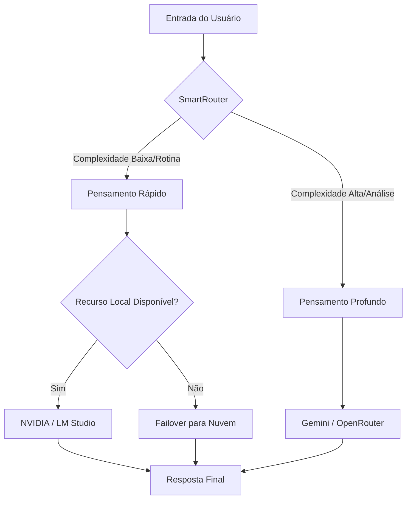

# Inteligência Híbrida do JARVIS

## Visão Geral
O sistema de Inteligência Híbrida do JARVIS é projetado para otimizar a eficiência computacional, a latência de resposta e a profundidade analítica através de um sistema de roteamento inteligente (**SmartRouter**). O objetivo é balancear a agilidade do processamento local com a potência de modelos de fronteira na nuvem.

## SmartRouter: O Cérebro do Roteamento
O `SmartRouter` atua como a camada de decisão que intercepta cada entrada do usuário e determina qual modelo é o mais adequado para a tarefa, baseando-se na complexidade da query, no contexto disponível e no estado do hardware.

### Lógica de Pensamento: Rápido vs. Profundo

O JARVIS opera em dois modos cognitivos principais, inspirados no sistema de processamento dual:

| Modo | Gatilho | Objetivo | Latência | Modelo Típico |
| :--- | :--- | :--- | :--- | :--- |
| **Pensamento Rápido** | Queries factuais, comandos simples, automações rotineiras. | Resposta instantânea e execução de tarefas. | Baixa | Local (NVIDIA/LM Studio) |
| **Pensamento Profundo** | Análises complexas, refatoração de arquitetura, dilemas lógicos. | Alta precisão, raciocínio multi-etapa, criatividade. | Média/Alta | Nuvem (Gemini/OpenRouter) |

### Fluxo de Decisão (Mermaid)

## Hierarquia de Modelos e Failover

Para garantir 100% de disponibilidade, o JARVIS implementa uma hierarquia rigorosa de preferência e redundância. Se um nível falhar ou atingir limite de quota, o sistema desce automaticamente para o próximo nível.

### Ordem de Prioridade

1. **Gemini (Primário Nuvem):** Utilizado para tarefas de alta complexidade, janelas de contexto massivas e integração com ecossistema Google.
2. **NVIDIA (Primário Local):** Utilizado para processamento de baixa latência, privacidade total e tarefas de "Pensamento Rápido" usando hardware local.
3. **LM Studio (Secundário Local):** Serve como redundância para modelos locais especializados ou quando a API da NVIDIA apresenta instabilidade.
4. **OpenRouter (Failover Final):** Gateway para múltiplos modelos (Claude, GPT-4, Llama 3). Ativado quando todos os anteriores falham ou quando um modelo específico de nicho é solicitado.

### Matriz de Failover

| Camada | Provedor | Tipo | Prioridade | Critério de Failover |
| :--- | :--- | :--- | :--- | :--- |
| 1 | Gemini | Nuvem | Alta (Deep) | Timeout > 15s ou Erro de API |
| 2 | NVIDIA | Local | Alta (Fast) | GPU Overload ou Erro de Driver |
| 3 | LM Studio | Local | Média (Fast) | Crash do Binário ou RAM insuficiente |
| 4 | OpenRouter | Nuvem | Baixa (Generic) | Esgotamento de Créditos |

## Especificações Técnicas de Implementação

### Critérios de Classificação do SmartRouter
O roteador utiliza as seguintes métricas para classificar a query:
- **Token Count:** Queries extremamente longas são enviadas para modelos com maior janela de contexto (Gemini).
- **Keywords:** Palavras como "analise", "otimize", "planeje" ativam o Pensamento Profundo.
- **Hardware State:** Se a GPU local estiver acima de 90% de uso, o roteamento é desviado para a nuvem para evitar travamentos do sistema.
