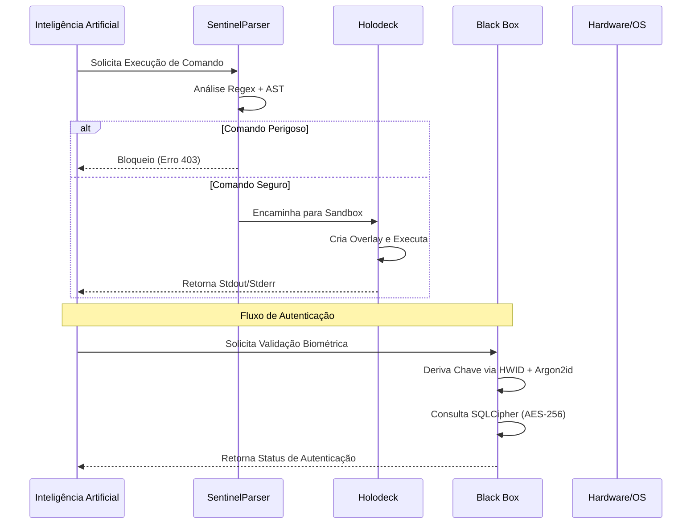

# Protocolo de Segurança 89: Blindagem e Validação

O Protocolo de Segurança 89 define as camadas de defesa do JARVIS, garantindo que a execução de código autogerado e o armazenamento de dados sensíveis sejam isolados e criptografados.

## 1. SentinelParser: Análise de AST e Validação
O `SentinelParser` é a primeira linha de defesa contra a execução de comandos destrutivos. Ele opera em duas camadas de análise.

### 1.1 Camada 1: Regex Blocklist
Varredura de strings em busca de padrões perigosos conhecidos.
- **Alvos:** `rm -rf`, `mkfs`, `format`, `dd`, `shutdown`, `reboot`, `chmod 777`.

### 1.2 Camada 2: Análise de Árvore de Sintaxe Abstrata (AST)
Para comandos que se assemelham a código Python, o Sentinel realiza o parsing do código para analisar a estrutura lógica antes da execução.

**Módulos Proibidos:**
- `os`, `sys`, `shutil`, `subprocess`, `socket`, `pty`.

**Funções Built-in Bloqueadas:**
- `eval()`, `exec()`, `breakpoint()`.

## 2. Holodeck: Sandbox Híbrido
O `Holodeck` é o sistema de isolamento de processos utilizado para executar código Python gerado dinamicamente pela IA.

### Mecanismo de Isolamento:
1. **Overlay Virtual:** Criação de um diretório temporário único para cada sessão (`/tmp/holodeck_sandbox/{session_id}`).
2. **Scrubbing de Ambiente:** O processo é iniciado com variáveis de ambiente limpas (`PYTHONPATH` e `HOME` apontando apenas para o sandbox).
3. **Limpeza Automática:** O diretório de overlay é destruído imediatamente após a execução ou timeout (padrão 30s).

## 3. Black Box: Cofre Biométrico e HWID
A `Black Box` provê armazenamento seguro para dados biométricos e chaves críticas, vinculando a segurança ao hardware físico.

### 3.1 SQLCipher + AES-256
Os dados são armazenados em um banco de dados SQLite criptografado via **SQLCipher**, utilizando criptografia AES-256.

### 3.2 Derivação de Chave via HWID (Hardware ID)
Para evitar a portabilidade do banco de dados para outras máquinas, a chave de descriptografia é derivada do HWID do sistema:
- **Windows:** Extração de UUID via `wmic csproduct get uuid`.
- **Linux:** Leitura de `/etc/machine-id`.
- **KDF (Key Derivation Function):** Utiliza **Argon2id** com um salt estático (`JARVIS_SENTINEL_v3_SALT_2026`) para transformar o HWID em uma chave criptográfica robusta.

## 4. Fluxo de Validação de Comandos

## 5. Especificações Técnicas de Segurança

| Componente | Tecnologia | Função Principal | Nível de Rigor |
| :--- | :--- | :--- | :--- |
| **Sentinel** | Python AST / Regex | Prevenção de Injeção | Crítico |
| **Holodeck** | Process Isolation | Execução Segura | Alto |
| **Black Box** | SQLCipher / Argon2id | Persistência Criptografada | Máximo |
| **HWID** | WMIC / Machine-ID | Vinculação Física | Absoluto |
