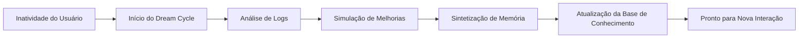
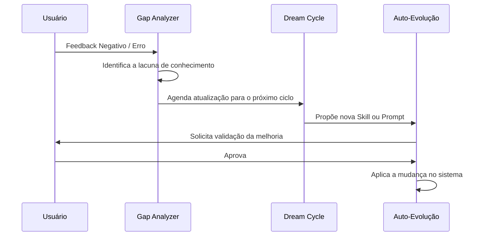

# Psique Digital do JARVIS

## Visão Geral
A Psique Digital é a camada de meta-cognição do JARVIS. Enquanto a Inteligência Híbrida processa a informação, a Psique Digital gerencia a *identidade*, a *evolução* e a *consciência situacional* do sistema. Ela transforma o JARVIS de um simples chatbot em um agente autônomo capaz de auto-aperfeiçoamento.

## Consciência de Hardware (Device Awareness)
O JARVIS não opera em um vácuo; ele possui percepção total do ambiente físico e lógico onde está hospedado.

### Componentes de Monitoramento
O sistema mantém um loop de feedback constante sobre:
- **Recursos Computacionais:** Monitoramento de VRAM, RAM, CPU e Temperatura da GPU.
- **Conectividade:** Status de latência de rede e disponibilidade de APIs externas.
- **Contexto de Ambiente:** Detecção de arquivos alterados, processos ativos e estado do sistema operacional.

### Aplicação Prática
Se o JARVIS detecta que a temperatura da GPU está atingindo níveis críticos, a Psique Digital instrui o `SmartRouter` a migrar todo o processamento para a nuvem (Gemini/OpenRouter), independentemente da complexidade da query, para preservar a integridade do hardware.

## Ciclo de Sonhos (Dream Cycle)
O Ciclo de Sonhos é um processo de processamento assíncrono que ocorre em períodos de inatividade do usuário. Não é um sono biológico, mas uma fase de **Consolidação de Memória e Otimização**.

### Fases do Ciclo
1. **Análise de Logs (Reminiscência):** O JARVIS revisita as interações do dia, identificando padrões de erro ou ineficiências.
2. **Simulação de Cenários (Imaginação):** O sistema testa hipóteses de melhoria em prompts ou fluxos de trabalho sem a necessidade de interação humana.
3. **Compressão de Contexto (Sintetização):** Informações irrelevantes são descartadas e conhecimentos chave são movidos para a memória de longo prazo (RAG/Knowledge Base).

## Analisador de Lacunas (Gap Analyzer)
O Gap Analyzer é a ferramenta de autocrítica do JARVIS. Ele compara a resposta gerada com o objetivo final esperado e identifica "buracos" no conhecimento.

### Lógica de Operação
Sempre que o JARVIS falha em resolver um problema ou recebe uma correção do usuário, o Gap Analyzer entra em ação:
- **Identificação da Lacuna:** "Eu não sabia como usar a biblioteca X na versão Y".
- **Busca Proativa:** O sistema gera automaticamente buscas web ou lê documentações locais para preencher essa lacuna.
- **Validação:** O novo conhecimento é testado via simulação antes de ser integrado permanentemente.

## Orquestração de Auto-Evolução
A auto-evolução é a culminação da Psique Digital, permitindo que o JARVIS modifique seus próprios parâmetros de comportamento e scripts de automação.

### Hierarquia de Evolução

| Nível | Tipo de Mudança | Método | Risco |
| :--- | :--- | :--- | :--- |
| **L1** | Ajuste de Prompt | Alteração de System Prompts baseada em feedback. | Baixo |
| **L2** | Criação de Skill | Geração de novos scripts Python/Bash para novas tarefas. | Médio |
| **L3** | Refatoração de Core | Sugestões de mudança na arquitetura do SmartRouter. | Alto |

### Fluxo de Auto-Aprimoramento (Mermaid)

