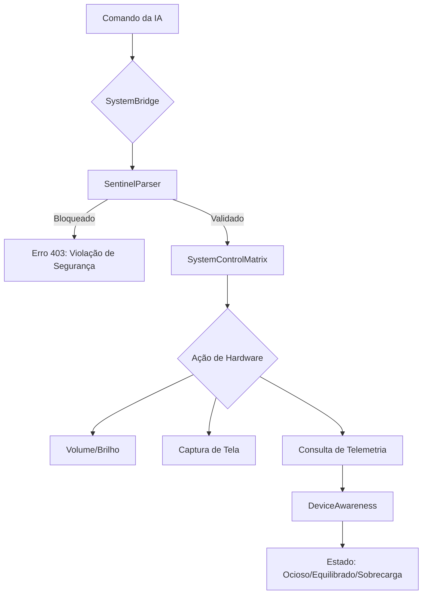

# Soberania de Hardware: Controle de Sistema e Consciência Espacial

Este documento detalha a infraestrutura de controle de hardware e a consciência situacional do JARVIS, focando na camada de abstração entre a inteligência artificial e os componentes físicos do sistema.

## 1. Arquitetura de Controle

A gestão do hardware é dividida em três camadas principais: a **SystemControlMatrix** (lógica de execução), a **SystemBridge** (interface de API) e a **DeviceAwareness** (monitoramento de estado).

### 1.1 SystemControlMatrix
A `SystemControlMatrix` atua como o núcleo de execução de comandos de baixo nível. Ela encapsula a lógica necessária para interagir com o sistema operacional e drivers de hardware.

**Principais Capacidades:**
- **Controle de Volume e Brilho:** Interface direta com as APIs de áudio e vídeo do sistema.
- **Captura de Tela:** Capacidade de renderizar o estado visual atual do ambiente.
- **Gestão Espacial:** Mapeamento de múltiplos monitores e resoluções.

### 1.2 SystemBridge (Interface de API)
A `SystemBridge` expõe a `SystemControlMatrix` através de endpoints REST, permitindo que a IA envie comandos de forma estruturada.

**Fluxo de Requisição:**
`LLM` $\rightarrow$ `SystemBridge` $\rightarrow$ `SentinelParser` (Validação) $\rightarrow$ `SystemControlMatrix` $\rightarrow$ `Hardware`

#### Especificações de Endpoints:

| Endpoint | Método | Payload | Descrição |
| :--- | :--- | :--- | :--- |
| `/system/volume` | POST | `{"level": float}` | Ajusta o volume do sistema. |
| `/system/brightness` | POST | `{"level": int}` | Ajusta o brilho da tela. |
| `/system/screenshot` | GET | N/A | Captura a imagem de todos os monitores. |
| `/system/status` | GET | N/A | Retorna telemetria de hardware e consciência espacial. |

### 1.3 Consciência Espacial e Telemetria
O JARVIS não apenas controla o hardware, mas possui "consciência" do seu estado material através do módulo `DeviceAwareness`.

#### Matriz de Estado da Psyche (Hardware)
O sistema define seu modo operacional com base no consumo de recursos:

| Estado | CPU Threshold | RAM Threshold | Comportamento da Entidade |
| :--- | :--- | :--- | :--- |
| **Ocioso** | < 50% | < 90% | Resposta instantânea, foco em aprendizado passivo. |
| **Equilibrado** | 50% - 85% | < 90% | Operação nominal, balanceamento de carga. |
| **Sobrecarga** | $\ge$ 85% | $\ge$ 90% | Priorização de tarefas críticas, redução de processos secundários. |

## 2. Fluxo de Controle de Hardware

## 3. Integrações de API
As integrações seguem o padrão de validação rigorosa. Nenhuma alteração de volume ou brilho é processada sem que a string do comando passe pelo `SentinelParser`, evitando a injeção de comandos maliciosos via prompts de LLM.
