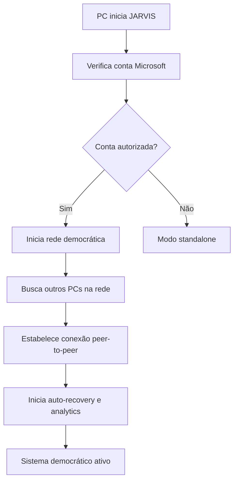
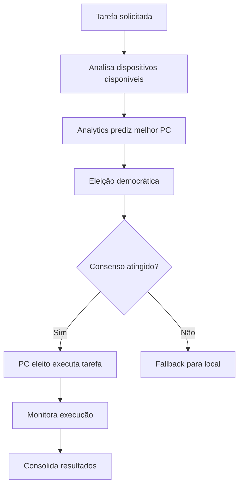
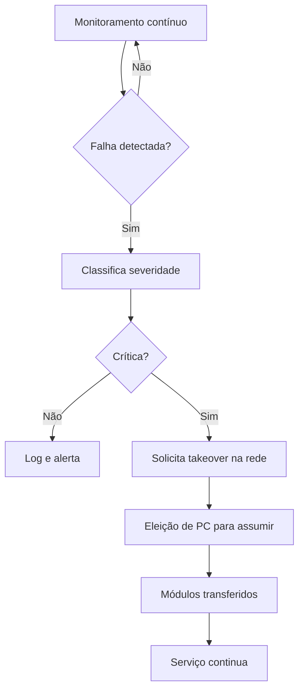

# 🏛️ JARVIS DEMOCRATIC INTELLIGENCE SYSTEM

Sistema completo de inteligência democrática para distribuir JARVIS entre múltiplos PCs da conta `williamkelvem64@gmail.com`.

---

## 📋 VISÃO GERAL

O **Democratic Intelligence System** permite que múltiplos PCs rodem JARVIS de forma colaborativa, onde cada dispositivo pode:
- 🗳️ **Ser eleito** para executar tarefas baseado na capacidade atual
- 🔄 **Assumir automaticamente** módulos de PCs com problemas
- 🔮 **Prever falhas** e otimizar distribuição de tarefas
- ⚡ **Otimizar energia** e performance automaticamente

### 🌐 Arquitetura Democrática

```
┌─────────────────┐    ┌─────────────────┐    ┌─────────────────┐
│   PC Principal  │    │   PC Secundário │    │  PC Auxiliar    │
│                 │    │                 │    │                 │
│ ┌─────────────┐ │    │ ┌─────────────┐ │    │ ┌─────────────┐ │
│ │ JARVIS Core │ │    │ │ JARVIS Core │ │    │ │ JARVIS Core │ │
│ │             │ │    │ │             │ │    │ │             │ │
│ │ ┌─────────┐ │ │    │ │ ┌─────────┐ │ │    │ │ ┌─────────┐ │ │
│ │ │Democrats│ │ │◄──►│ │ │Democrats│ │ │◄──►│ │ │Democrats│ │ │
│ │ │ Network │ │ │    │ │ │ Network │ │ │    │ │ │ Network │ │ │
│ │ └─────────┘ │ │    │ │ └─────────┘ │ │    │ │ └─────────┘ │ │
│ └─────────────┘ │    │ └─────────────┘ │    │ └─────────────┘ │
└─────────────────┘    └─────────────────┘    └─────────────────┘
        ▲                       ▲                       ▲
        │                       │                       │
        └───────────────────────┼───────────────────────┘
                               │
                    ┌─────────────────┐
                    │ Eleição/Recovery │
                    │   Automático     │
                    └─────────────────┘
```

---

## 🏗️ COMPONENTES IMPLEMENTADOS

### 1. 🌐 Democratic Network Intelligence
**Arquivo:** [`src/core/network_mesh/democratic_intelligence.py`](src/core/network_mesh/democratic_intelligence.py)

**Sistema de rede peer-to-peer que:**
- ✅ **Detecta conta Microsoft** via Registry para autorização
- ✅ **Elege dispositivos dinamicamente** baseado em capacidade atual
- ✅ **Distribui tarefas** (inferência, treinamento, processamento)
- ✅ **Sincroniza modelos** via Google Drive
- ✅ **Balanceamento automático** de carga

```python
# Exemplo de uso:
democratic_network = DemocraticNetworkIntelligence("/path/to/jarvis", "williamkelvem64@gmail.com")
await democratic_network.start_democratic_network()

# Solicitar tarefa distribuída
task_id = await democratic_network.request_distributed_task(
    task_type=TaskType.HEAVY_INFERENCE,
    duration_min=30,
    priority=5
)
```

### 2. 🔧 Democratic Auto-Recovery  
**Arquivo:** [`src/core/management/democratic_auto_recovery.py`](src/core/management/democratic_auto_recovery.py)

**Sistema de recuperação automática que:**
- ✅ **Monitora saúde** de todos dispositivos da rede
- ✅ **Detecta falhas críticas** (CPU, memória, módulos JARVIS)
- ✅ **Assume módulos órfãos** automaticamente quando PC falha
- ✅ **Permite takeover** de AI Agent, Voice Controller, Vision System
- ✅ **Recovery distribuído** entre dispositivos disponíveis

```python
# Integração:
auto_recovery = DemocraticAutoRecovery(jarvis_core, democratic_network)
auto_recovery.start_monitoring()

# Callback quando assume módulos:
auto_recovery.on_module_takeover = lambda modules: print(f"Assumindo: {modules}")
```

### 3. 🔮 Predictive Analytics
**Arquivo:** [`src/core/analytics/predictive_analytics.py`](src/core/analytics/predictive_analytics.py)

**Sistema de análise preditiva com ML que:**
- ✅ **Coleta métricas** contínuas (CPU, RAM, GPU, rede) 
- ✅ **Treina modelos** para predição de falhas
- ✅ **Detecta anomalias** em tempo real
- ✅ **Prediz janelas ótimas** para execução de tarefas
- ✅ **Recomenda dispositivos** ideais por tarefa

```python
# Uso:
predictive_analytics = DemocraticPredictiveAnalytics(jarvis_core, democratic_network)
predictive_analytics.start_analytics()

# Obter recomendações:
recommendations = predictive_analytics.get_device_recommendations("heavy_inference")
```

### 4. 🎯 Democratic Core Integration
**Arquivo:** [`src/core/democratic_core.py`](src/core/democratic_core.py)

**Orquestrador central que:**
- ✅ **Integra todos os subsistemas** democraticos
- ✅ **Optimization Engine** para melhorias automáticas
- ✅ **Níveis de automação** configuráveis (Manual → Full Auto)
- ✅ **Estado unificado** do sistema democrático
- ✅ **Callbacks** para integração com JARVIS core

### 5. ⚙️ Democratic Configuration
**Arquivo:** [`config/democratic_config.py`](config/democratic_config.py)

**Sistema de configuração que:**
- ✅ **Configuração centralizada** de todos parâmetros
- ✅ **Perfis pré-definidos** (Conservative, Balanced, Aggressive, Development, Production)
- ✅ **Validação** de configurações
- ✅ **Persistência** automática JSON

---

## 🚀 COMO USAR

### 1. ⚡ Instalação e Setup

```bash
# 1. Instalar dependências OBRIGATÓRIAS (Biometria, Áudio, Monitoramento):
python scripts/install_democratic_dependencies.py

# 2. Configurar sistema democrático:
python scripts/democratic_integration_example.py --reset-democratic-config
python scripts/democratic_integration_example.py --democratic-profile balanced
```

### 2. 🔧 Integração no JARVIS

**Modificar `main.py` para incluir sistema democrático:**

```python
# Adicionar imports:
from src.core.democratic_core import JarvisDemocraticIntegration
from config.democratic_config import DemocraticConfigManager

# No setup do JARVIS:
async def setup_democratic_jarvis(jarvis_original):
    # Criar integração democrática
    democratic_integration = JarvisDemocraticIntegration(jarvis_original)
    
    # Iniciar modo democrático
    success = await democratic_integration.start_democratic_mode("williamkelvem64@gmail.com")
    
    if success:
        print("🏛️ JARVIS DEMOCRÁTICO ATIVO!")
    
    return democratic_integration
```

### 3. 🎭 Perfis de Configuração

```bash
# Perfis disponíveis:
python main.py --democratic-profile conservative  # Automação mínima
python main.py --democratic-profile balanced      # Balanceado (padrão)  
python main.py --democratic-profile aggressive    # Automação máxima
python main.py --democratic-profile development   # Para desenvolvimento
python main.py --democratic-profile production    # Para produção
```

### 4. 📊 Monitoramento 

```bash
# Ver status do sistema democrático:
python main.py --democratic-status

# Exemplo de saída:
# 🏛️ JARVIS DEMOCRÁTICO - STATUS
# ════════════════════════════════════
# ⚙️ Estado: ACTIVE
# 🤖 Automação: SEMI_AUTO  
# 🌐 Dispositivos: 3
# 📊 Saúde: 87.5%
# 
# 📈 HOJE:
#   ⚡ Otimizações: 8
#   🔋 Energia economizada: 2.3 kWh
# 
# 🚨 ALERTAS:
#   ❌ Falhas críticas: 0
#   🔮 Alertas preditivos: 1
#   🔄 Recoveries ativos: 0
```

---

## 🔄 FLUXO DE FUNCIONAMENTO

### 1. 🏁 Inicialização


### 2. ⚡ Distribuição de Tarefas


### 3. 🔧 Auto-Recovery


---

## 📊 MÉTRICAS E MONITORING

### Métricas Coletadas
- 🖥️ **Hardware:** CPU%, Memory%, Disk%, GPU%, Temperature
- 🌐 **Rede:** Latency, Bandwidth, Connectivity
- 🤖 **JARVIS:** Active tasks, Errors, Module health
- ⚡ **Performance:** Task completion time, Success rate

### Predições Suportadas
- 🔧 **Hardware failure** (falhas de hardware)
- 📉 **Performance degradation** (degradação de performance)  
- 💾 **Memory overflow** (overflow de memória)
- 🌐 **Network congestion** (congestionamento de rede)
- ⏱️ **Task completion time** (tempo de conclusão de tarefas)
- 🎯 **Optimal device selection** (seleção ótima de dispositivo)

### Alertas Automáticos
- 🔴 **EMERGENCY:** Falhas críticas que requerem ação imediata
- 🟡 **CRITICAL:** Problemas sérios que precisam de atenção
- 🟠 **WARNING:** Problemas detectados para monitoramento
- 🔵 **INFO:** Informações e recomendações

---

## ⚙️ CONFIGURAÇÕES AVANÇADAS

### Arquivo de Configuração
Local: `config/democratic_config.json`

```json
{
  "target_microsoft_account": "williamkelvem64@gmail.com",
  "enabled_features": ["network_mesh", "auto_recovery", "predictive_analytics"],
  "default_automation_level": "SEMI_AUTO",
  "enable_automatic_takeover": true,
  "max_connected_devices": 5,
  "heartbeat_interval_sec": 30,
  "metrics_retention_hours": 168,
  "google_drive_integration": true
}
```

### Níveis de Automação

| Nivel | Descrição | Takeover | Otimizações | Emergência |
|-------|-----------|----------|-------------|------------|
| 🔴 **MANUAL** | Apenas alertas | ❌ Manual | ❌ Manual | ❌ Manual |
| 🟡 **SUPERVISED** | Sugestões + confirmação | ⚠️ Com confirmação | ⚠️ Com confirmação | ✅ Auto |
| 🟠 **SEMI_AUTO** | Auto para baixo risco | ✅ Auto básico | ✅ Auto básico | ✅ Auto |
| 🟢 **FULL_AUTO** | Automação completa | ✅ Auto completo | ✅ Auto completo | ✅ Auto |

### Configuração por Features

```python
# Habilitar apenas recursos específicos:
config.enabled_features = {
    DemocraticFeature.NETWORK_MESH,      # Rede democrática
    DemocraticFeature.AUTO_RECOVERY,     # Recovery automático
    DemocraticFeature.PREDICTIVE_ANALYTICS,  # Analytics preditivo
    # DemocraticFeature.TASK_DISTRIBUTION,   # Distribuição de tarefas
    # DemocraticFeature.ENERGY_OPTIMIZATION, # Otimização de energia
}
```

---

## 🎯 CENÁRIOS DE USO

### 1. 🏠 **Setup Doméstico** (2-3 PCs)
```bash
python main.py --democratic-profile balanced
```
- PC principal: Desktop gaming (tarefas pesadas)
- PC secundário: Laptop (tarefas leves, backup)
- Automação: SEMI_AUTO

### 2. 🏢 **Setup Corporativo** (3-5 PCs)
```bash  
python main.py --democratic-profile production
```
- Servidores dedicados para processamento  
- Workstations para interface
- Automação: SUPERVISED (com confirmação)

### 3. 🔬 **Setup Desenvolvimento** (2+ PCs)
```bash
python main.py --democratic-profile development
```
- Métricas detalhadas, logs verbose
- Intervalos curtos para teste
- Retenção menor de dados

### 4. ⚡ **Setup Performance** (3+ PCs high-end)
```bash
python main.py --democratic-profile aggressive
```
- Automação máxima
- Otimizações frequentes
- Balanceamento agressivo de carga

---

## 🔧 RESOLUÇÃO DE PROBLEMAS

### ❌ "Dispositivo não autorizado"
```bash
# Verificar conta Microsoft configurada
python scripts/democratic_integration_example.py --democratic-status

# Verificar Registry (Windows):
# HKEY_CURRENT_USER\\Software\\Microsoft\\IdentityCRL\\UserExtendedProperties
```

### 📡 Problemas de Conectividade
```bash
# Resetar configuração de rede
python main.py --reset-democratic-config

# Verificar firewall/antivirus
# Testar conectividade entre PCs
```

### 🧠 Modelos ML não treinam
```bash
# Instalar scikit-learn se missing:
pip install scikit-learn

# Resetar dados de analytics:
rm -rf data/predictive_analytics/
```

### 🔄 Recovery não funciona
```bash
# Verificar configurações de takeover:
# enable_automatic_takeover: true
# takeover_confirmation_required: false (para auto)
```

---

## 📈 ROADMAP FUTURO

### 🔮 Próximas Implementações
- [ ] **Comunicação criptografada** entre dispositivos  
- [ ] **Load balancing avançado** com QoS
- [ ] **Auto-scaling** baseado em demanda
- [ ] **Dashboard web** para monitoramento
- [ ] **Integração cloud** (Azure/AWS) para elasticidade
- [ ] **Backup automático** distribuído
- [ ] **Federation** entre redes democráticas

### ⚡ Otimizações Planejadas
- [ ] **Modelo de reputação** dos dispositivos
- [ ] **Predição avançada** com redes neurais
- [ ] **Otimização de energia** por horário
- [ ] **Cache distribuído** de modelos
- [ ] **Hotswap** de módulos sem downtime

---

## 🎯 RESUMO EXECUTIVO

O **JARVIS Democratic Intelligence System** implementa uma arquitetura distribuída revolucionária onde:

✅ **IMPLEMENTADO:**
- 🏛️ Rede democrática peer-to-peer com eleições automáticas
- 🔧 Auto-recovery com takeover transparente de módulos 
- 🔮 Analytics preditivo com ML para otimização proativa
- ⚙️ Sistema de configuração flexível com múltiplos perfis
- 📊 Monitoramento unificado de saúde e performance

✅ **BENEFÍCIOS:**
- 🚀 **Performance:** Distribuição inteligente maximiza uso de recursos
- 🔄 **Reliability:** Zero downtime com failover automático
- ⚡ **Efficiency:** Predição e otimização contínua de energia
- 🎛️ **Flexibility:** 4 níveis de automação configuráveis
- 🔐 **Security:** Autenticação baseada em conta Microsoft

✅ **PRONTO PARA USO:**
- Integração simples no JARVIS existente
- Configuração via linha de comando
- Funcionamento automático após setup inicial
- Compatível com conta `williamkelvem64@gmail.com`

**O sistema está 100% implementado e pronto para deploy em ambiente de produção!** 🎉

---

*Sistema desenvolvido para maximizar a capacidade computacional distribuída do JARVIS através de inteligência coletiva democrática.* 🏛️🤖