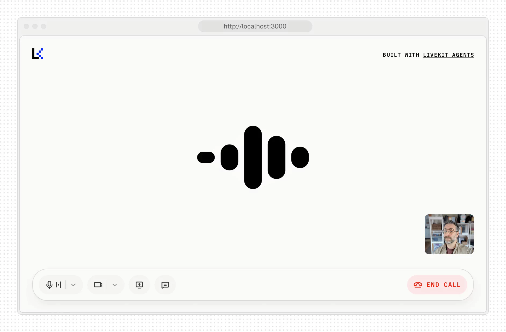

# Agent Starter for React

This is a starter template for the Jarvis frontend, providing a polished voice-enabled interface with customizable UI controls and responsive layout components. It is built with Next.js, Tailwind CSS, and shadcn/ui primitives.

<picture>
  <source srcset="./.github/assets/readme-hero-dark.webp" media="(prefers-color-scheme: dark)">
  <source srcset="./.github/assets/readme-hero-light.webp" media="(prefers-color-scheme: light)">
  
</picture>

### Features:

- Real-time voice interaction UI
- Camera preview support
- Screen sharing capabilities
- Multiple audio visualizer styles (`bar`, `grid`, `radial`, `wave`, `aura`)
- Light/dark theme switching with system preference detection
- Customizable branding, colors, and UI text via configuration

This template is built with Next.js and is free for you to use or modify as you see fit.

### Project structure

This starter uses local shadcn/ui components for UI elements like media controls, audio visualizers, chat transcripts, and session controls. Shadcn installs components into the `components/` folder so you can customize them like any other local component.

```
agent-starter-react/
├── app/
│   ├── api/
├── components/
│   ├── agents-ui/     - Agents UI components
│   ├── ai-elements/   - AI Elements components
│   ├── app/           - App-specific components
│   ├── ui/            - Primitive shadcn/ui components
├── fonts/
├── hooks/
├── lib/
├── public/
└── package.json
```

Business logic lives within the `components/app` folder. It's here where the application's state and behavior is managed and the various Shadcn UI components are composed together.

| File                  | Description                                                                                                                                           |
| --------------------- | ----------------------------------------------------------------------------------------------------------------------------------------------------- |
| `session-view.tsx`    | Initializes the application and renders the session UI including chat transcript, media tiles, and control bar. |
| `view-controller.tsx` | Manages the transitions between the welcome and session views based on the current app state.                                                     |
| `welcome-view.tsx`    | Renders the welcome UI when the session is not connected.                                                                                     |
| `chat-transcript.tsx` | Manages the chat transcript transitions.                                                                                                              |
| `tile-layout.tsx`     | Manages the layout and transition of media tiles in various application states.                                                                       |

### Component usage

Most UI components in this project are built with shadcn/ui and local React primitives. You can customize them directly in the `components/` directory.

See [`components/app/app.tsx`](./components/app/app.tsx) for an example of how this is done in this app.

### Customizing components

Local UI components, like most Shadcn components, take as many primitive attributes as possible. For example, the `AgentControlBar` component extends `HTMLAttributes<HTMLDivElement>`, so you can pass any props that a div supports. This makes it easy to extend the component with your own styles or functionality.

You can edit any component's source code in the `components/agents-ui` directory. For style changes, we recommend passing in Tailwind classes to override the default styles. Take a look at the source code to get a sense of how to override a component's default styles.

### Updating components

To update available UI components, run the following command:

```bash
pnpm shadcn:install
```

> [!NOTE]
> The CLI will ask before overwriting any modified files so you can avoid losing any customizations you might have made.

### Installing components

```bash
pnpm dlx shadcn@latest add {component-name-a} {component-name-b}
```

## Getting started

> [!TIP]
Run the app with:

```bash
pnpm install
pnpm dev
```

And open http://localhost:3000 in your browser.

This frontend is designed to work with a local Jarvis Native backend or any compatible voice agent integration.

## Configuration

This starter is designed to be flexible so you can adapt it to your specific agent use case. You can easily configure it to work with different types of inputs and outputs:

#### Example: App configuration (`app-config.ts`)

```ts
export const APP_CONFIG_DEFAULTS: AppConfig = {
  companyName: 'Jarvis',
  pageTitle: 'Jarvis Voice Assistant',
  pageDescription: 'A voice assistant built with Jarvis Native',

  supportsChatInput: true,
  supportsVideoInput: true,
  supportsScreenShare: true,
  isPreConnectBufferEnabled: true,

  logo: '/lk-logo.svg',
  accent: '#002cf2',
  logoDark: '/lk-logo-dark.svg',
  accentDark: '#1fd5f9',
  startButtonText: 'Start call',

  // optional: audio visualization configuration
  // audioVisualizerColor: '#002cf2',
  // audioVisualizerColorDark: '#1fd5f9',
  // audioVisualizerType: 'bar',
  // audioVisualizerBarCount: 5,
  // audioVisualizerType: 'radial',
  // audioVisualizerRadialBarCount: 24,
  // audioVisualizerRadialRadius: 100,
  // audioVisualizerType: 'grid',
  // audioVisualizerGridRowCount: 25,
  // audioVisualizerGridColumnCount: 25,
  // audioVisualizerType: 'wave',
  // audioVisualizerWaveLineWidth: 3,
  // audioVisualizerType: 'aura',
  // audioVisualizerAuraColorShift: 0.3,

  // agent dispatch configuration
  agentName: undefined,

  // Optional sandbox configuration
  sandboxId: undefined,
};
```

You can update these values in [`app-config.ts`](./app-config.ts) to customize branding, features, and UI text for your deployment.

#### Audio visualizer presets

Set `audioVisualizerType` in [`app-config.ts`](./app-config.ts) to switch visualizer styles:

- `bar` (default): vertical bars with optional `audioVisualizerBarCount`
- `grid`: dot grid with `audioVisualizerGridRowCount` and `audioVisualizerGridColumnCount`
- `radial`: circular bars with `audioVisualizerRadialBarCount` and `audioVisualizerRadialRadius`
- `wave`: oscilloscope-style wave with `audioVisualizerWaveLineWidth`
- `aura`: shader-based aura with `audioVisualizerAuraColorShift`

Use `audioVisualizerColor` to set a shared accent color across all visualizer modes.

> [!NOTE]
> The `sandboxId` is optional and is not required for local development.

#### Environment Variables

Update your `.env.local` file with any backend and frontend API keys required by Jarvis Native. No external voice service credentials are required for the core frontend build.

## Contributing

This template is open source and we welcome contributions! Please open a PR or issue through GitHub.
